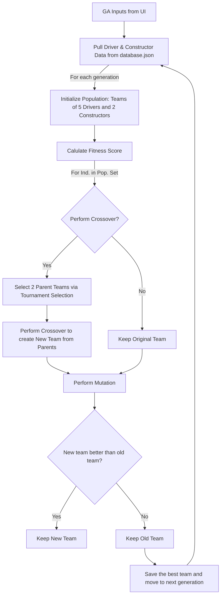

# F1 Fantasy Team Builder

  
Table of Contents

  <ol>
    <li><a href="#about-the-project">About The Project</a></li>
    <li><a href="#overall-tech-stack">Tech Stack</a></li>
    <li><a href="#getting-started">App Usage</a></li>
    <li><a href="#genetic-algorithm-details">GA Details</a></li>
    <li><a href="#feature-notes">App Notes</a></li>
    <li><a href="#license">License</a></li>
    <li><a href="#contact-info">Contact</a></li>
  </ol>

## About the Project
The following repository uses a Genetic Algorithm (GA) to create a F1 Fantasy Team optimized for maximum performance within a given budget. 

The team are developmed using F1 driver and constructors prices, along with the weekly budget constraints, given on the F1 Fanstasy [website](https://fantasy.formula1.com/en/create-team).

The prices for each driver and constructor are static at the start of the season and dynamically evolve as the season goes on depending on their respective performance. Similarly, a budget of 100 million is set out at the season and the amount grows and contracts as the season progresses depending on performance.

### Overall Tech Stack
The tech stack is as follows:

`[Insert pic here]`

- Python
  - All scripts to handle:
    - FastAPI routes to and from frontend
    - Processing frontend inputs
    - Populating frontend with default, queryed, or computed items
    - Using [FastF1](https://github.com/theOehrly/Fast-F1) to access F1 session results
    - Files to interface with "database"

- FastAPI
  - Handles the routes between the backend and frontend for the UI pages outlined in the Vue section 

- Vue
  - Frontend pages of interest
    - Main page: Nothing too exciting, just tells the user to navigate to the Positions tab
    - Positions: Uses FastF1 to populate the positions of drivers for user-specified race weekend
    - Prices: User inputs for driver and constructor prices for a given user-specified race weekened
    - Optimizer Inputs: Parameters used in GA execution to create the optimal team, more details provided in the <a href="#genetic-algorithm-details">GA Details</a> Section
    - Generate Team: The optimal team generation process is initiated here and the team is displayed

- Render
  - Used for hosting the repository
    - [Frontend](https://f1-fantasy-model.onrender.com/): The application UI
    - [Backend](https://f1-fantasy-model-backend.onrender.com/docs): Here, the FastAPI routes can be visualized and tinkered with

- Note that a database service isn't listed here. I started making this app before I understood what a database was or how a database was used so I implemented a local .json file based "database".
  - I **am** planning on a SQLite integration for this app but I'm busy working on other side-projects at the moment. :)

## Getting Started
`[Insert pic here]`
- UI Usage

## Genetic Algorithm Details
`[Insert pic here]`

- Elitism
- Mutation 
  - Varying rate
- Crossover 
  - Tournament selection for parents

## Feature Notes
1) Currently, I haven't incorported anything to account for the various perks on the F1 Fantasy Game.
2) I haven't integrated a database solution with the project. My plan (that is currently on pause) is to deploy a SQLite integration onto AWS so that I can learn AWS but I have gotten to this yet.

## License
Distributed under the MIT License. See `LICENSE.txt` for more information.

## Contact Info
Malav Naik \
Email: malavnaik12@gmail.com \
To learn more about myself and other projects I have contributed to, visit my [website.](https://sites.google.com/view/malavnaik) :)